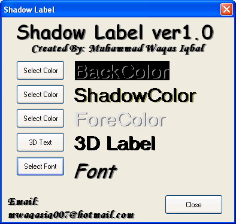



## Shadow Label\(New\)

### Description

this is m first active-x control plz vote for it if you like, your vote will give me the courage to contribute in the world of vb thank you this is shadow label and you can even change the color of shadow and also you can make a 3d label
 
### More Info
 

             |
---                |---
**Submitted On**   |2005-01-20 00:29:32
**By**             |[Muhammad Waqas Iqbal](https://github.com/Planet-Source-Code/PSCIndex/blob/master/ByAuthor/muhammad-waqas-iqbal.md)
**Level**          |Intermediate
**User Rating**    |4.7 (14 globes from 3 users)
**Compatibility**  |VB 6\.0
**Category**       |[Custom Controls/ Forms/  Menus](https://github.com/Planet-Source-Code/PSCIndex/blob/master/ByCategory/custom-controls-forms-menus__1-4.md)
**World**          |[Visual Basic](https://github.com/Planet-Source-Code/PSCIndex/blob/master/ByWorld/visual-basic.md)
**Archive File**   |[Shadow\_Lab1919347312005\.zip](https://github.com/Planet-Source-Code/muhammad-waqas-iqbal-shadow-label-new__1-61997/archive/master.zip)

